# MyWarrantyAndInvoice

## Description

This web platform is dedicated to managing invoices and product warranties, providing users with an efficient way to organize their expenses and track the rights associated with their purchases. In an ever-expanding digital landscape, where efficient resource management is becoming increasingly important, the platform offers practical and easily accessible solutions.

By centralizing all invoices in one place, users no longer need to search for physical documents or worry about losing them. Additionally, by digitizing warranties, users can easily monitor validity periods and receive notifications when expiration dates are approaching, helping them avoid losing valuable rights.

Another major advantage is enhanced accessibility and data security. Since information is stored in a digital environment, it is easier to access and protect against loss or damage to physical documents.

Technologies used:

Backend: PHP, Laravel, RESTful API

Frontend: Vue.js, Tailwind CSS for a modern and responsive design

Communication between frontend and backend: Axios

This combination of technologies ensures high performance, scalability, and a smooth, intuitive user experience.
## Screenshots

### Welcome Page
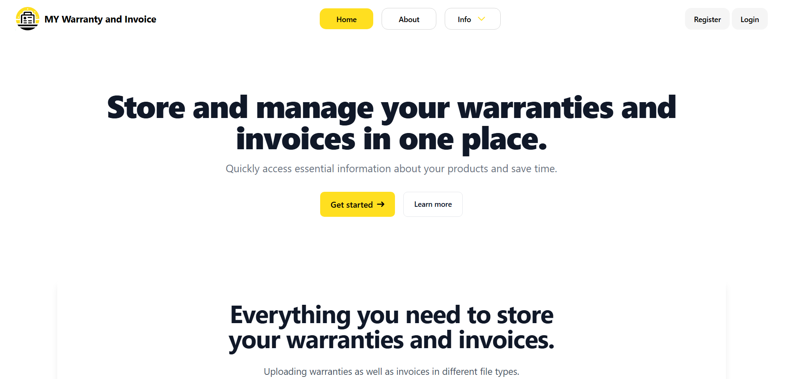 

### About Page
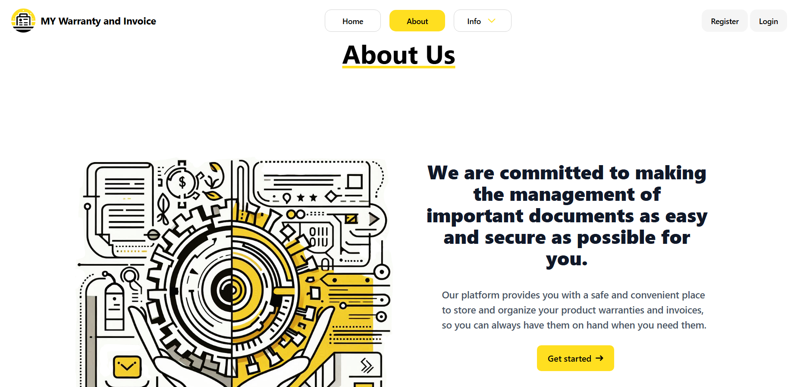

### FAQ Page
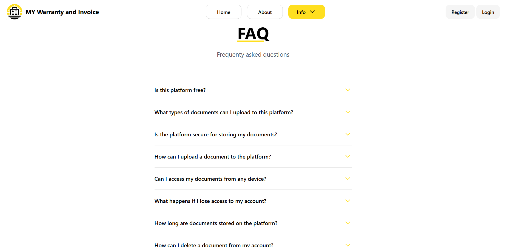

### Register Page
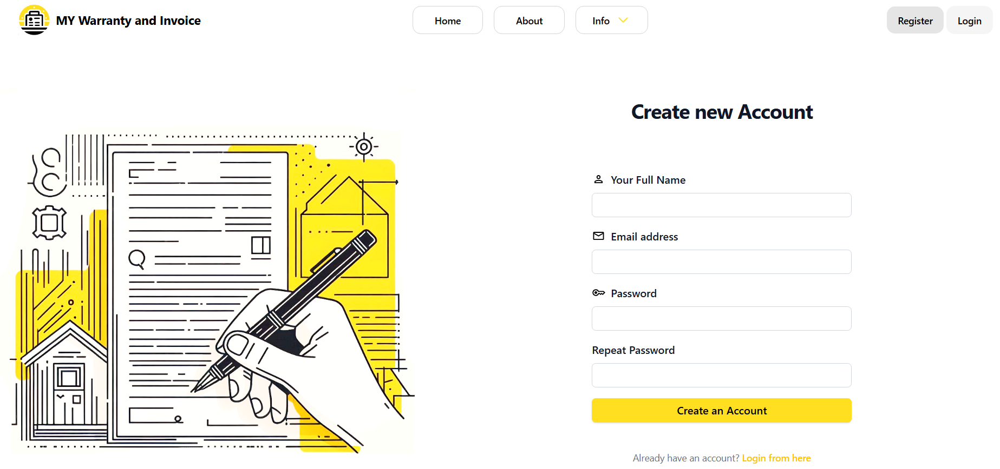

### Dashboard Page
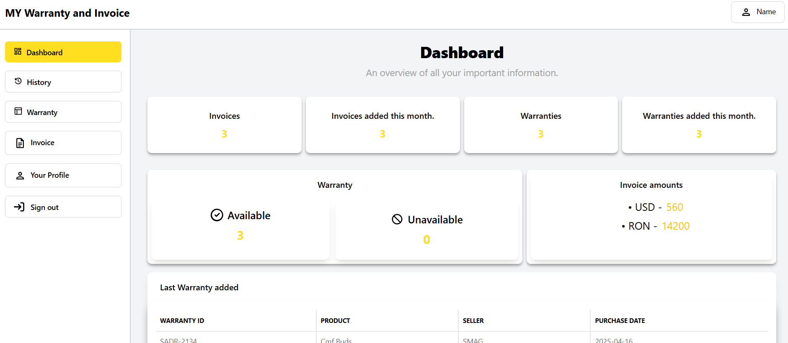

### History Page
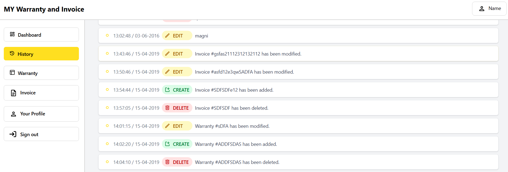

### Warranties Page
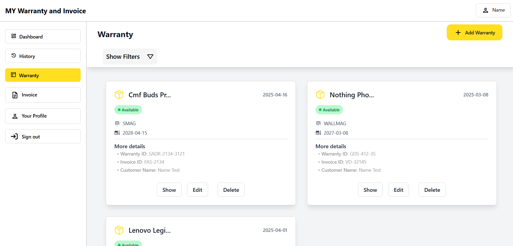

### Warranty View Page
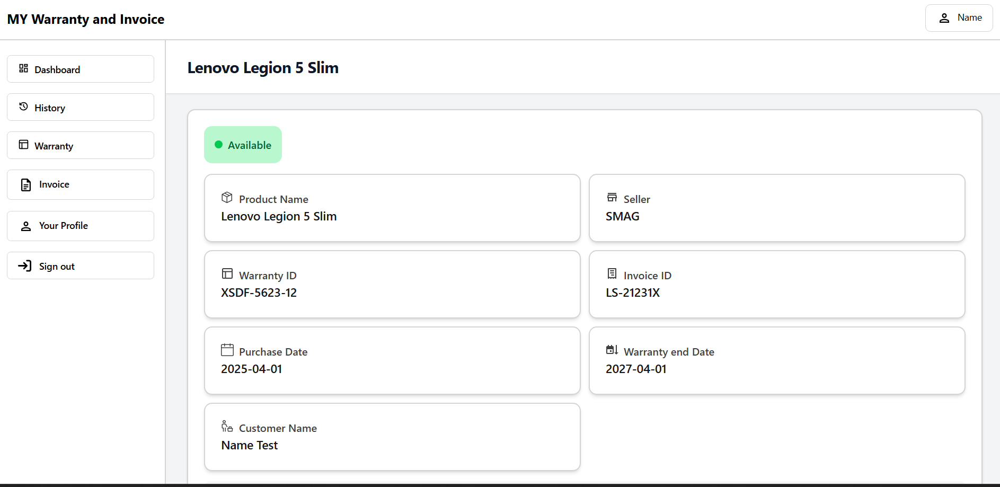

### Warranty Add Page
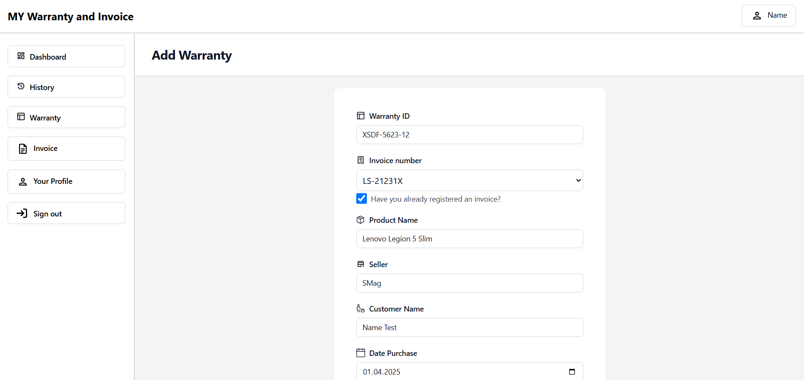

### Invoices Page
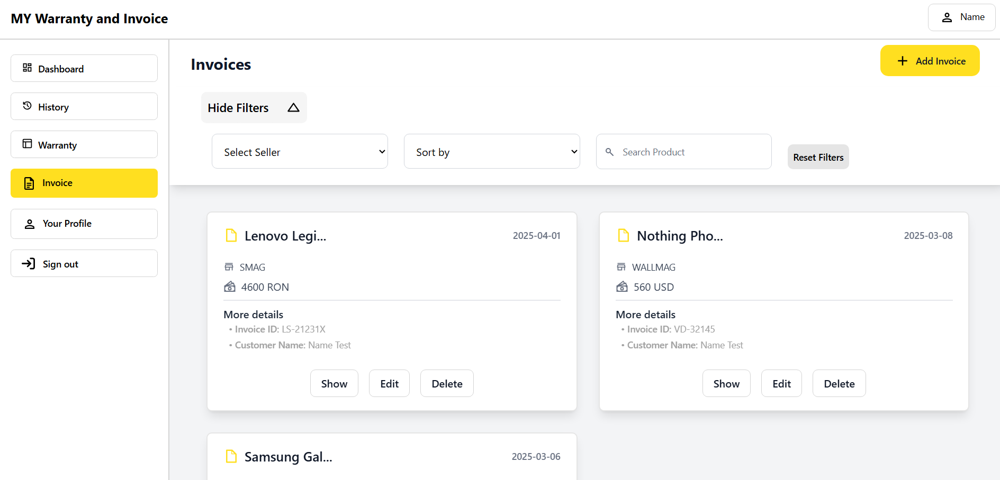

### Invoice View Page
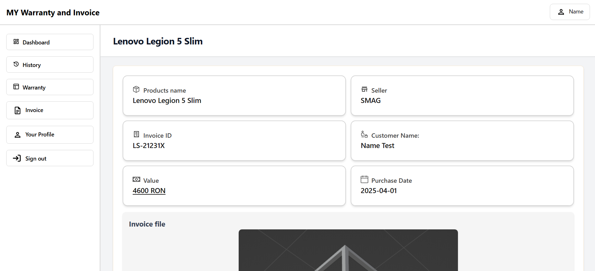

### Invoice Add Page
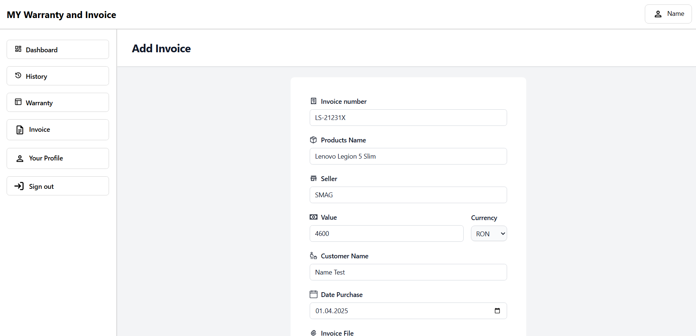

### Profile Page
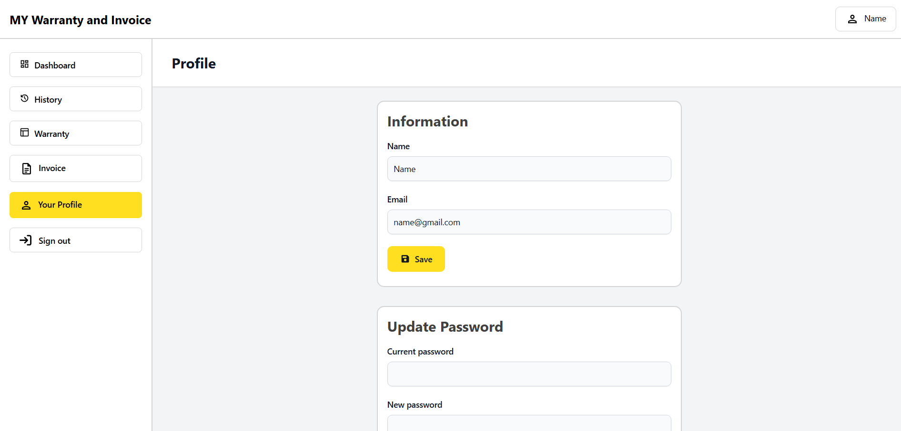